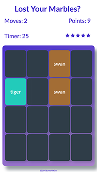
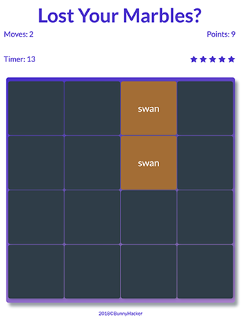
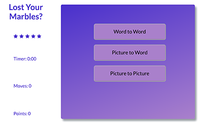

# Memory Match Game: Lost Your Marbles
##### Project for the *Front-End Web Developer Nanodegree*

#### Introduction

**Title**: Memory Match Game: Lost Your Marbles

*Lost Your Marbles* is a memory match game similar to the game Concentration.  The goal is to match all the pairs in the quickest time.  The player earns points for matches, loses points for non-matches and keeps stars for the least amount of non-matches.  The quickest time is kept in the leader-board which is shown at the end of every win.

Click [here](#picture-of-responsive-design-website) to see pictures of the website's Responsive Design.

##### Technical Components
- CSS Grid, Flexbox and Media Queries used to build the _responsive features_.
- JavaScript (ECMASript 6) and jQuery 3.3.1 are used for user interactions which include:
    - choose from three types of games to play
    - turn over two cards (compare for match or not match)
    - audio sfx to embellish button clicks, turning over cards, winning and losing the game
    - counter to keep track of how many turns it takes to win the game
    - points: 10 points for matches, -1 point for non-match
    - incrementing timer to see how quickly it takes to win the game
    - 5 stars for visual guide on amount of non-matches; losing all stars means losing the game
- ```localStorage``` to store the highest score.  Code guidelines from [w3schools]("https://www.w3schools.com/htmL/html5_webstorage.asp")
- CSS for animations [w3schools]("https://www.w3schools.com/css/css3_animations.asp")
- CSS for card _shake_ [w3schools]("https://www.w3schools.com/howto/howto_css_shake_image.asp")
- _How to clear out an array_ code snippet from [stack overflow]("https://stackoverflow.com/questions/1232040/how-do-i-empty-an-array-in-javascript")  as suggested by [Anthony]("https://stackoverflow.com/users/1047275/anthony")
- Button Sfx
    - starting idea from [video by Adam Khoury]("https://www.youtube.com/watch?v=VlwSz2dXK_8")
    - more detail information from various docs at [w3school]("https://www.w3schools.com/tags/ref_av_dom.asp")


#### Pictures of Responsive Design of Game
##### Phone




##### Tablet




##### Desk Top



### Future Features
- Add name for leader board
- Rework color scheme and add art to UI
- Add more sfx to interactions with game
- fix two bugs that happen when clicking 2 cards over
    - if click too fast, can turn over cards
    - can click the same card for a match
    - to refine the limiting to two cards I tried the following, but the doesn't work on cards
    ```
    $('.game-board').prop("disabled", true);

	document.querySelector('.game-board').disabled=true;

	$('game-board').attr("disabled", true);
    ```
    - asked my mentor, he gave this sample, but only works until there is a match, then no cards can flip--I still need to figure it out
    ```
        if ($('.show').length > 1) {
	        return true;
	    }
    ```
- Refactor into React
- Add more game vocabulary
